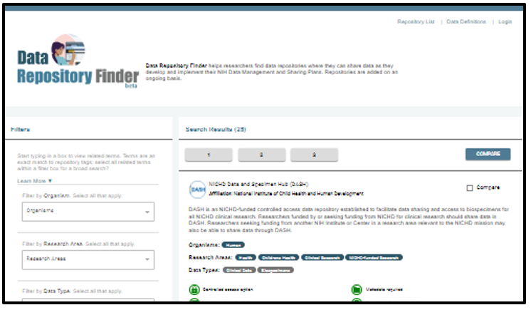

#### Library Main Navigation: &nbsp; &nbsp;  <b> [Ecosystem Library Home](https://github.com/NIH-NICHD-Ecosystem)  </b> &nbsp; | &nbsp;[User Stories](https://github.com/NIH-NICHD-Ecosystem/UserStories/blob/main/README.md) &nbsp; | &nbsp; [Efforts](https://github.com/NIH-NICHD-Ecosystem/Efforts/blob/main/README.md) &nbsp; | &nbsp; Library Help

 

# Library Help

This page contains information about the NICHD Ecosystem Library (or “Library”) structure and how to use Library contents. This page details the following:
- [Library Documentation Structure](#library-documentation-structure) which details the main components of user needs documentation in the Library.
- [Glossary](#glossary) which provides a list of terms and definitions for Library documents.

##### Need additional assistance? Contact [NICHDecosystem@nih.gov](mailto:NICHDecosystem@nih.gov?subject=Ecosystem_Library)

   
  
## Library Documentation Structure

 

 
  
### The *NICHD Ecosystem Library* is built to ensure traceability from  *(user stories)*   to initiatives that aim to address them *(efforts)*.
  
 

  
 
  
#### One user story can result in many efforts, or many user stories can motive or inform one effort. Technical efforts are also associated with uses cases (functional requirements).
  
 

### User Stories

  <table>
  <tr>
    <th width="400">Example</th>
    <th width="400">Description</th>
  </tr>
  <tr>
    <td><b><i>"As an NICHD researcher, I want to find the best data repositories for the sharing scientific data that I am generating in my project and understand the repository's submission and sharing practices so  I can complete my Data Management and Sharing Plan."</b></i></td>
    <td align="left">Data ecosystem improvements start with <i>User Stories</i>, which document desired features or processes from data ecosystem users.   User stories drive development, assessment, or implementation <i>Efforts</i> and are used to develop  <i>Use Cases</i> for technical efforts.
    </td>
  </tr>
</table> 

 

### Efforts

  <table>
  <tr>
    <td width="400">
    </td>
    <td width="400" align="left"> Efforts are projects or initiatives that aim to address, in whole or in part, community needs described in <i>User Stories</i>.   Technical <i>Efforts</i> may be formally described by <i>Use Cases</i>.
    </td>
  </tr>
</table> 

  

### Use Cases

  <table>
  <tr>
    <td width="400">
        

            
 Text description of the Use Cases Diagram Example 
            

The Use Cases Diagram example describes the scope of the Data Repository Finder effort. There are three primary actors: A repository subject matter expert (SME), a repository publisher, and a repository searcher. For a Repository Searcher, the main use case is to identify a repository, which includes selecting a repository. For a Repository SME, the main use case is to add a repository, which includes editing a repository, and selecting a repository. For a Repository publisher, the main use case is to publish a repository, which includes editing a repository, and selecting a repository. Viewing provenance extends editing and publishing a repository, and includes selecting a repository. 
        

    </td>
    <td width="400" align="left">Use cases are formal descriptions of functional requirements originating from <i>User Stories</i>.    Groups of use cases described in a Use Cases Diagram define the scope of technical <i>Efforts</i>.
    </td>
  </tr>
</table> 

 

 
</div/

 

## Glossary

Terms below apply to the NICHD Use Case Library and associated documentation.

*↗️ External link, NIH is not responsible for content of external sites*

|Term | Definition | Source/Links|
| :------------ | :------------- | :------------- | 
|Actor | A person, organization, or external system that needs to interact with a given system. Actor requirements are detailed as use cases in the Use Case Diagram.   In Library documents, Actors can map to multiple users from User Stories, as they represent users who may have different titles within an organization but have similar goals or requirements within an Effort.  | http://agilemodeling.com/style/useCaseDiagram.htm ↗️|
|Current Workflow | This workflow type details the current process which the new feature or function is intended to replace. Library documents do not require a specific structure to describe current processes; documenters may want to consider using a narrative example, structured text description, a diagram, or a combination of descriptors.   Though it is good practice to document the current state, including a Current Workflow is optional for Library documentation. | Workflow description: https://www.ncbi.nlm.nih.gov/books/NBK2638/ ↗️
|Effort | A project or initiative that aims to address, in whole or in part, community needs described in User Stories.    Technical Efforts may be formally described by Use Cases.
|Intended Workflow | This workflow type breaks a given use case down into actor starting and end points, actions, and decision points to describe actions as well as relationships between actions. The intended workflow describes the future state using a diagram detailing the order of actions and calling out actor decision points.  Library documents require a list of preconditions for the workflow, and a description of the actions in the workflow to accompany the diagram.   Intended Workflow is required for each use case in Library documents. | Workflow description: https://www.ncbi.nlm.nih.gov/books/NBK2638/ ↗️   Example workflow diagram:  https://support.microsoft.com/en-us/office/create-a-basic-flowchart-in-visio-e207d975-4a51-4bfa-a356-eeec314bd276 ↗️|
|Related Users | In Library documents, refers to a number of Users from the ecosystem list that are collectively represented by an Actor in the UML Use Case and Use Case Story. |  |
|Sequence Diagram | In UML, this diagram models the flow of logic within a system in a visual manner, enabling both documentation and validation of that logic. Sequence diagrams are commonly used for both analysis and design purposes.   Library documentation requires a sequence diagram for each use case, and a description of the sequenced actions to accompany the diagram.. | http://agilemodeling.com/artifacts/sequenceDiagram.htm ↗️|
|Unified Modeling Language (UML) | A language to visualize and describe software and business models. Some UML diagrams are used to specify the attributes of the Use Case Library. | https://en.wikipedia.org/wiki/Unified_Modeling_Language ↗️|
|Use Cases Diagram | A standard UML diagram which summarizes the details of a system's users (called Actors) and their interactions with the system (called Use Cases). This structure is used to define the scope of the system, and model goals of different system Actors.     To describe use cases, Library documents require a table to accompany the diagram with the use cases, related actors, and related user stories listed. | https://www.lucidchart.com/pages/uml-use-case-diagram ↗️    http://agilemodeling.com/style/useCaseDiagram.htm ↗️|
|Use Case | Represents a specific functional requirement or interaction from the User/Actor perspective.   Multiple use cases detailed in a use case diagram are used to define the scope of the system.   Library documents require an intended workflow to describe each use case.  | https://www.lucidchart.com/pages/uml-use-case-diagram ↗️    http://agilemodeling.com/style/useCaseDiagram.htm ↗️|
|User | Customers of a data ecosystem. These customers can be end-users or internal customers/colleagues within an organization who depend on ecosystem tools and capabilities.   In Library documents, user needs are described by User Stories and cataloged in the Story Tracker document. Users with similar goals for a given effort will be grouped according to those goals and represented as “Actors” in a use cases diagram. | https://www.atlassian.com/agile/project-management/user-stories ↗️|
|User Story  | An informal, general explanation of a desired ecosystem feature or process written from the perspective of a specific end user. The purpose of a User Story is to articulate how a piece of work will deliver a particular value back to the user.   Its basic form follows Agile development guidance with the template: As a (user), I (want to), (so that).    Library user stories are gathered from the NICHD community and are used to initiate Ecosystem efforts. Library documents should each link back to origin user stories.  | https://www.atlassian.com/agile/project-management/user-stories ↗️|
|Workflow  | A workflow is a description of a set of tasks that are necessary to accomplish a given goal for a given actor or actors.   There are two workflow types indicated by Library documents:  1. *Intended workflow (required)*  2. *Current workflow (optional) ↗️ | Workflow description: https://www.ncbi.nlm.nih.gov/books/NBK2638/ ↗️   Example workflow diagram:  https://support.microsoft.com/en-us/office/create-a-basic-flowchart-in-visio-e207d975-4a51-4bfa-a356-eeec314bd276 ↗️|

*↗️ External link, NIH is not responsible for content of external sites*
 
 
